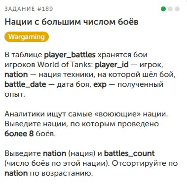

👾День 3👾

Приветствую, путник.

Вот и настал третий день нашего пути. Как и говорил ранее, решил сделать упор на базы данных.
Поэтому ворвался на курсы по ```SQL```, завершил модуль *«Основы выборки II»* и сразу же прошёл *«Манипулирование данными»*.

Сложилось ощущение, что ```SQLAcademy``` (https://sql-academy.org/ru) делает упор на свой ИИ. Задания скачут от невероятно лёгких до совершенно непонятных, причём в самом начале, когда нужно больше разъяснений, попадаются задачи, где условие уместилось в два слова и ты не понимаешь, что требуется. А когда уже разобрался и хочешь вызова, дают упражнения, где за тебя практически всё решили.

Поэтому, когда закончил модуль, вернулся к практике на тренажёре. Завершил порядка 10 задач, но одна ударила прямо в сердечко – задание с собеседования в ```Wargaming```. Справился с лёгкостью и сразу же отправил решение в компанию.



Надеюсь, я прошёл и меня возьмут. Берегись, Кипр!

🔥Спасибо, что дошёл до конца.

*P.S. Не забыть добавить в рабочий отчёт за пятницу: Прошёл собес в Wargaming.*