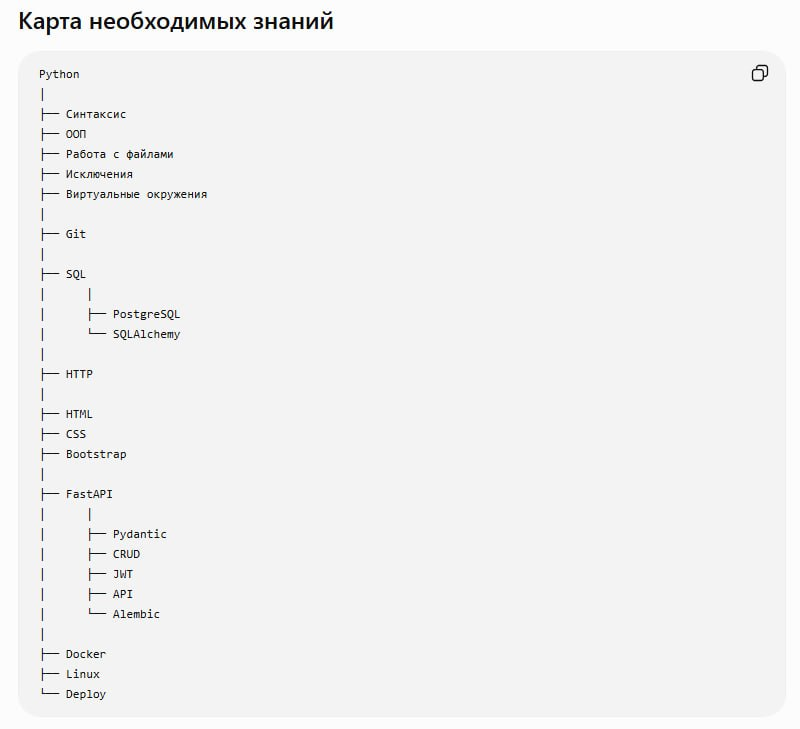

👾**День 6**👾

Как и говорил, интересного было мало. Сегодня взялся за дорожную карту проекта. Расписал шаги по созданию БД, искал, где лучше визуализировать процесс, и немного пощупал ```Figma```. Думаю, что будет неплохо оформить шаги именно там. Заодно научусь основам работы.

На бумаге (да, я старовер и до сих пор предпочитаю писать в блокнот) набросал заметки по созданию ER-схемы БД. Посмотрел, где можно её нарисовать, и пришёл к выводу, что лучше остаться в ```Visio```.

После начал думать, что же я хочу от проекта. После поиска и общения с ИИ набросал навыки, которые могут пригодиться: ```Python, Git, SQL, http, html, CSS, Bootstrap, FastAPI, Docker, Linux, Deploy```.

Куда я вписался? И зачем мне все это?😁 

Спасибо, что дошел до конца и до скорой встречи.



#roadtotechwritter