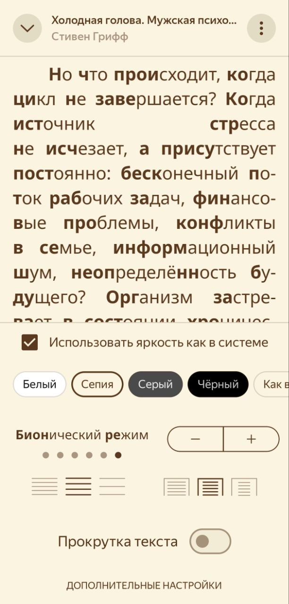
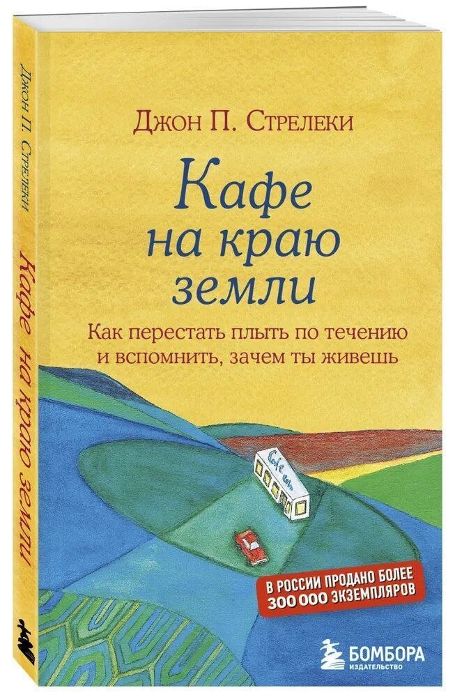
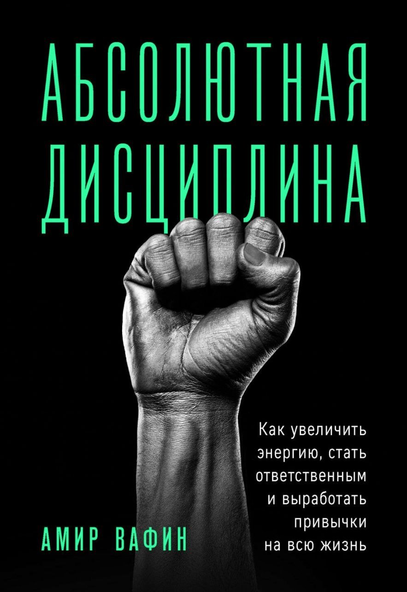

### Бионический шрифт

Хотел поделиться одной интересной штукой. Мне о ней ещё давно говорили, но я успешно забыл и случайно вспомнил, когда ковырялся в настройках шрифтов в «Букмейте».

🔤Бионический шрифт. Это способ форматирования текста, при котором программа выделяет более ярким цветом первую часть каждого слова.

Как говорят, одним из плюсов является более высокая скорость чтения. Не могу сказать, что ты сразу превратишься в скорочитателя, но в целом текст проглатывать будешь чуть быстрее.

Больше я заметил, что после привыкания читать удобнее. Глаза не так устают.

Плюсом я добавил режим «Сепия». В совокупности читать становится действительно комфортнее. 

Спустя полчаса ты даже не замечаешь, как долго уже читаешь с телефона. Раньше для меня это было проблемой. Уже через 10–15 минут чтения хотелось посмотреть вдаль и немного передохнуть. С таким набором настроек это происходит гораздо реже, а усталость наступает позже.

Поэтому, если любишь почитать подольше, то крайне советую протестировать.

### Джон П. Стрелеки "Кафе на краю земли"

***К разговору "если меня выгонят из СТ".***

Есть книга (https://books.yandex.ru/audiobooks/GdNp7PYh?utm_source=direct_link&utm_campaign=users_referral&utm_medium=referral) после которой хочется задать себе вопросы:
- Той ли жизнью я живу?
- Почему каждый день делаю это?
- Что на самом деле мне приносит счастье?

При этом первая книга читается за один вечер и удивительной лёгкостью. 

Вторая (https://books.yandex.ru/audiobooks/Jx0vnpPF?utm_source=direct_link&utm_campaign=users_referral&utm_medium=referral) чуть подольше, но тебе уже сложно остановится и я осилил ее в пару дней.

Если захочется послушать в аудио версии, то можно услышать голос Всеволода Кузнецова. Маэстро как всегда вдохнул жизнь в каждого героя.

Завязка книги начинается с того что, главный герой, Джон, погряз в рутине, потерял смысл и впал в апатию. Отправившись в отпуск, он сбивается с пути: ломается навигатор, заканчивается бензин. В растерянности он находит загадочное кафе. Оно называется "Почему". Меню в этом заведении не список блюд, а три ключевых вопроса:
Почему вы здесь?
Боитесь ли вы смерти?
Удовлетворены ли вы?
Дальше он пытается разобраться, что это за кафе и ответить на вопросы в меню.

❗️После прочтения есть шанс уволиться самому. Будьте аккуратны.

#what_read

### Кэл Ньюпорт "Хватит мечтать. Займись делом. Почему важнее хорошо работать, чем найти хорошую работу."

🤓***Ещё одна книга из недавних, которую советую почитать, особенно если есть выгорание на работе.***

Автор рассказывает истории людей, которые достигли успеха. Однако есть причина, которая подкупила меня, и я стал читать книгу взахлёб.

В книге рассматривается популярный призыв: «Найдите работу своей мечты! Бросьте всё. Неважно, как и где вы будете. Схватите мечту» и показывает иной подход.

🥷Первой же историей он заставляет задуматься над этим лозунгом, рассказывая о Томасе, который очень хотел стать буддийским монахом. Тот бросил работу и ушёл в монастырь. Томас пробыл там несколько лет, и автор рассказывает, что встретил его плачущим у дерева и жалеющим о своей мечте. Что в итоге случилось с Томасом, вы узнаете в финале книги. Это лишь одна из многих историй, но именно она не даёт отложить чтение.

❓На протяжении всей книги автор старается ответить на главный вопрос: «Как найти работу мечты?».

✍️После прочтения я понял, чего хочу от работы. Если задаёшься тем же вопросом, то эта книга для тебя.

#what_read

=================================================

### Амир Вафин "Абсолютная дисциплина"

***Еще одна причина, по которой решил записывать, что было сделано, и вставать в пять утра.***

Когда начинаешь читать, первая мысль: *"Да ну, это база, это всем понятно"*. Однако это тот случай, когда тебе нужен кто-то со стороны, чтобы сказал очевидное. С каждой новой главой всё раскладывается по полочкам планов и привычек.

Благодаря этой книге получилось начать и, надеюсь, не бросить тренировки, чтение и обучение. Иногда по чуть-чуть, не спеша, но каждый день. На текущий момент уже почти два месяца, как получается не бросить всё и не вернуться в прежнее состояние.

В конце книги предлагается завести дневник или блог для публичного отчета, чтобы было ощущение, что его ждут, и это придавало дополнительную ответственность. Могу сказать, что это действительно подталкивает к продолжению.

Если ты давно хотел что-то начать, но никак не получалось, то советую к прочтению.

#what_read