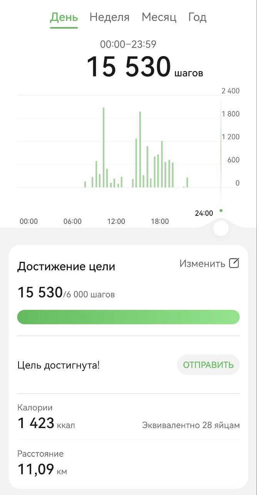
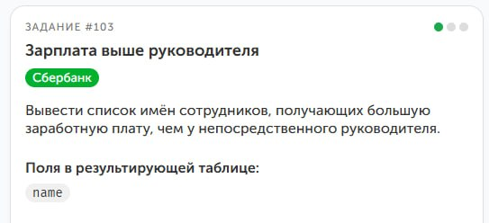

👾День 21👾

Пошла третья неделя. Пока не хочу оглядываться, потому что в планах никаких грандиозных изменений нет. Продолжил изучать *Git*, придерживаюсь графика и постараюсь пройти его до конца недели.

Всё же днях подведу итоги трёх недель, чтобы понять, что было позади. Думал, что в отпуске будет больше времени. Как же я ошибался. Удаётся выделить на курсы всего пару часов вечером.

В общем, долго грузить не буду: придерживаюсь плана, а дальше по ситуации.

Спасибо, что продолжаешь читать. До скорой встречи! Обещаю, что дальше будет интереснее.

#roadtotechwritter

👾День 20👾

Сегодня пост особо короткий, но не по той причине, о которой вы могли подумать. Закончил проверки *БД ЦСП*, сделал пару отчётов, сравнил с *1С*  ошибок и различий пока не нашёл. Можно сказать, что пока это успех. Теперь остаётся сделать пару скриптов для дальнейшего заполнения и обновления и можно начинать ими пользоваться. 

Первое время буду дублировать данные для полных тестов, пока не перейду полностью на *SQL*. А в идеале сделать уже веб-приложение. Но уже есть лёгкое чувство гордости. Ведь мечтал и планировал это последние пару лет.

🕵️Немного продвинулся в расследовании. Оно оказалось немного запутанным, да и свободного времени было мало, поэтому завтра ещё поковыряю.

И, конечно, не забыл про Git продолжил курсы, сделал первые репозитории и, надеюсь, до конца недели всё закончу.

А на этом всё. Спасибо, что дочитал до конца, и до скорой встречи!

#roadtotechwritter

👾**День 19**👾

Сегодня почти весь день занимался *БД ЦСП*. Проверки дали свои плоды: я успешно нашёл неточности в данных и корректно загрузил их в таблицы, соблюдая все связи. Это, конечно, требует много времени, но результат того стоит.

Продолжили снимать сериал про детектива Хлебушка. Интересное ещё впереди. Завтра планируется выход новой серии.

А следующим пунктом плана на отпуск будет изучение *Docs as Code*. Заодно пробегусь по *Git* и опубликую БД вместе со скриптами создания и заполнения.

В последние дни отчёты получаются короткими, да и работа проходит довольно однообразно. Возможно, скоро удастся порадовать вас чем-то более интересным.

А на этом пока всё. Спасибо, что дочитал до конца, и до скорой встречи!

#roadtotechwritter

👾**День 18**👾

В отпуске у меня обычно две традиции. ~~Жевать жвачку и надирать жопы, жвачку я уже дожевал~~ сбрить бороду и переустанавливать систему.
Бороду я так и не сбрил, ибо спойлер есть шанс оказаться на работе в отпуске. 

Поэтому взялся за выброс мусора из ноута и перестановку системы. К вечеру успешно всё было окончено.

Остаток дня потратил на курсы по *SQL* и попутное заполнение *БД ЦСП*. Пока всё идёт гладко и каждую итерацию проверяю. Ошибок пока не нашёл. Надеюсь, так и продолжится. Буду держать в курсе.

Также закончились съёмки серии приключений Детектива Хлебушка. Завтра будет выпущена для всех. Премиум подписчики получат в секретном чате на несколько часов раньше. Следите за обновлениями.

А пока на этом всё. Спасибо, что дошёл до конца и до скорой встречи.

👾**День 17**👾

Ух. Денёк оказался жаркий. Постараюсь по порядку. Сегодня сделал уклон в заполнение БД. Пожалуй, не ошибся. Когда заполнял последнюю таблицу, то вспомнил нюанс, который надо было учитывать в самом начале. В своё время результаты заполняли несколько человек и делалось это не всегда аккуратно. В итоге имеем лишние пробелы, опечатки и невозможность правильно соединить календарный план с результатами. Из-за этого ключи не подтягиваются корректно и начинают появляться дубли. В общем, решил всё начать заново, с учётом всех ошибок.

Ещё вспомнил, что у меня остался непройденный курс по *SQL*, который я когда-то купил на *Stepik*. Поэтому вернулся к нему и прошёл несколько задач.

На этом пока всё. Спасибо, что дошёл до конца и до скорой встречи!

#roadtotechwritter

👾**День 16**👾

Помнится, я пытался выбрать синюю или красную таблетку при изучении матриц. В итоге решил следовать за чёрным ублюдком белым кроликом и судьба вновь свела меня с гетерохромией. Поэтому сегодня коротенько: похоже, буду переводиться в ночной режим и отправлять отчёты на утро.

Однако, несмотря ни на что, сегодня удалось немного заняться *Python*: порешать пару задач про кортежи и попытаться глубже разобраться в теме. И я понял, что тут уже следует не спешить, а постараться достичь полного понимания.

Также продолжил заполнять таблицы *БД ЦСП*. Количество спортсменов дало о себе знать и пришлось немного повозиться с внешними ключами. Пока не смог справиться с ними, поэтому оставил на более свежую голову.

Не забыл и про детектива Хлебушка. Сценарий почти закончен. Съёмки эпизодов уже начались, и скоро смогу показать тебе, что из этого вышло.

А пока на этом всё. Спасибо, что остаёшься рядом и до скорой встречи!

#roadtotechwritter

👾**День 15**👾

Сегодня коротенько.
Продолжаем действовать согласно плану. Пробежался по книге Васильева. Осилил несколько глав и закрыл задачи для каждой. Дошёл до раздела с кортежами. Теорию проглотил осталось поглотить практику. Думаю, завтра с этого и начну.

Искал новые дела для Детектива Хлебушка. Нашёл пару дел. Осталось снять серию. Режиссёр уже найден. Идёт работа над сценарием. В ближайшие дни начнём производство. Новые интриги и не менее запутанные расследования.

Продолжил заполнять *БД ЦСП*. Потребовалось немного больше времени. Удалось загрузить информацию о спортивных учреждениях, тренерах и сотрудниках. Но когда сделал выгрузку спортсменов и увидел цифру в 3,5 тысячи, то понял, что финальный босс еще впереди. Удалось оформить около половины. А дальше еще выгрузить результаты все результаты с 2022 года по текущий. 

К чему я это всё. Конец еще не близок. Но мы обязательно к нему придём.

А на этом всё. Спасибо, что дочитал до конца.


#roadtotechwritter

👾**День 14**👾

Вот и пошла вторая неделя. Признаться, думал, будет сложнее поддерживать ежедневный марафон. Но уже даже стал получать некое удовольствие от процесса. Посмотрим, что будет на 21 день. Может, выработается привычка? Спойлер: нет. Никогда со мной так не работало.

***ТОГДА*** (здесь должна быть заставка сериала ~~Супернатуралы~~ Сверхъестественное).

🐍За вторую неделю удалось завершить разделы курса по ```Python``` *«Повторяем основные конструкции языка Python»*, *«Тип данных bool и NoneType»*, *«Вложенные списки»*. На вложенных списках немного подольше посидел и у DeepSeek попросил задач на практику. Показалось, что более-менее разобрался. 

Сегодня взялся за матрицы. Сделал несколько задач, но они как-то тяжеловато дались. Причём задачи от нейросети более-менее давались, а вот на *Stepik* я спотыкался. Подумал, что надо сделать шаг назад и пробежаться по умной книге. С курсом для начинающих я также поступал и это очень помогло. Стало гораздо проще двигаться дальше.

🤓Остановился на книге Алексея Васильева *"Программирование на Python в примерах и задачах"*. В прошлом году учил ```C#``` по его книге. Прекрасная книга. Материал отлично изложен и уже ближе к концу можно было делать мини-приложения. А потом меня ударили палкой по голове и я решил перейти на ```Python```. Буду рассказывать в дальнейшем, как её прохожу.

🕵️‍♀️Продолжил и закончил расследование Детектива Хлебушка. Осталось только оформить. Но довольно забавно было. Хорошо помогает изучить *SQL-запросы* и ```JOIN```. Спойлер: убийца садовник.

Также наконец-то смог заняться *БД ЦСП*. Сегодня удалось заполнить несколько таблиц *(Календарный план, Виды спорта)*. Уже можно делать небольшие отчёты. Чуть позднее похвастаюсь подробнее. Думаю, на выходных уже получится полностью закончить перенос.

А на этом пока всё. Большое спасибо, что продолжаешь читать и поддерживать мою писанину. Крепко обнял и покружил.

До скорой встречи.

#roadtotechwritter

👾**День 13**👾

Чёртовый день. Продолжаем двигаться согласно плану. Сегодня немного позанимался ```Python```. Завершил подраздел про вложенные списки и немного прочитал теорию про матрицы. Пока в раздумьях: брать синюю или красную?

Продолжил расследование Мистера Хлебушка. Думал, что там приключение на 15 минут и я быстро разберусь, но оказалось всё не так-то просто и очевидно. Следи за событиями в сериале *«Детективное агентство детектива Хлебушка»*. Завтра новая серия.

Ну и самое важное. Дело сдвинулось с мёртвой точки. Сделал таблицы для *БД ЦСП*. Успел заполнить таблицу субъектов РФ. Попросил *DeepSeek* написать скрипт по выгрузке, потому что вручную я бы неделю переписывал города, посёлки и сёла. Закинул разряды и почти накатал виды спорта.

Дальше начнётся самое интересное. Надо будет придумать, как раскидать остальную информацию и учесть, что теперь значения будут заполняться согласно индекса. Позже расскажу, как прошло.

🔥А на этом пока всё. Спасибо, что дошёл до конца.

#roadtotechwritter

👾**День 12**👾

С каждой цифрой становится всё более страшно. Кажется, что столько времени уже прошло, а стоишь на том же месте. Перечитал дневные отчёты и немного отлегло. 😁

Сегодня продолжил вникать в ```Python```. Ещё раз похвалил себя ~~(кто, если не я)~~, что поковырял промпт и попросил нейросеть дополнительно меня обучать с помощью задачек. 

После пяти задач на закрепление темы курс на ```Stepik``` даётся легче. Хотя некоторые всё равно приводят в ступор, но тут скорее, не из-за незнания синтаксиса, а из-за непонимания того, как подступиться к задаче и что именно от тебя хотят.

Подумал, что нужно не забывать про ```SQL```, поэтому продолжил расследование. Создал отдельную тему. Буду держать в курсе.

Пока на этом всё. На днях надеюсь, получится сесть за мини-проекты, и расскажу о них, как и обещал.

Спасибо, что дошёл до конца, и до скорой встречи!

#roadtotechwritter

👾**День 11**👾

🐍Сегодня удалось заняться только курсами ```Python```. Завершил два подраздела и изучил вложенные списки. Сразу же пришла в голова идея, как это можно реализовать. В голове ещё два мини-проекта.

Один для тренировок. Он небольшой и уже работает, но, применив новые знания, было бы неплохо превратить его в бота и немного улучшить. Расскажу тебе о нём позднее.

Второй надо обмозговать на бумаге. Было бы славно сделать бота, который будет подбирать рацион на день и давать ссылки на рецепты. Ведь самый частый вопрос: *«Что приготовить?»*.

```Stepik``` напомнил, что прошла ещё одна неделя, и даже немного похвалил. Приятно.

🔥Пока на этом всё. Спасибо, что дочитал до конца, и до скорой встречи!

#roadtotechwritter

👾**День 10**👾

Сегодня закончил рисовать схему. На первый взгляд выглядит даже логично. Однако есть подозрения, что ошибки всплывут во время создания базы. Завтра планирую начать заполнять таблицы и постараюсь сделать хотя бы парочку.

🐍Удалось пройти раздел *«Тип данных bool и NoneType»*, решил пару задач. Поймал себя на мысли: чем больше узнаю, тем острее ощущение, что я ничего не знаю. Впереди ещё несколько книг и написание собственных проектов. Поэтому сделаю упор на курс, а по окончании пробегусь по нескольким книгам.

Снова коротко, великих достижений нет. Интересных задач тоже не появлялось. До «детектива» сегодня не успел добраться. Надеюсь, далее будет чем поделиться.

🔥А на этом пока всё. Спасибо, что дошёл до конца.

#roadtotechwritter

👾**День 9**👾

Сегодня получился небольшой детокс.

🐔Пошёл смотреть на китайских курочек. Спойлер: не понравилось. Белгородские курочки интереснее.

До ноута добрался уже поздно вечером. Всё же удалось немного поработать над схемой. Почти закончил и надеюсь, что завтра уже смогу полноценно её показать и формировать таблицы для заполнения.
Перед сном планирую решить пару задач по Python, чтобы с чувством выполненного долга закруглиться.

Отчёт сегодня получился очень коротким, но спасибо, что дочитал до конца.



#roadtotechwritter

👾**День 8**👾

🐍Сегодня день Python. 

Решил 8 задач. Пару задач приводили в уныние: казалось, что пройденный курс для начинающих ничему не научил. Всё же когда удавалось найти решение, приходило осознание, насколько это гениально. Задача заставляет использовать уже изученные инструменты, но в таком ракурсе, с которым ты ещё не встречался.

Из интересного попалась задача на игру *"Камень, ножницы, бумага"*. К счастью, я уже сталкивался с ней в книге *Head First Python*. Поэтому проблем не возникло.
Но автор курса всегда держит интересное на потом, и следующим заданием стала вариация игры *"Камень, ножницы, бумага, ящерица, Спок"*. Код, подготовленный ранее очень помог и получилось успешно пройти это задание.

На этом раздел был пройден и с чувством гордости я закрыл вкладку.

Остаток времени потратил на отрисовку схемы БД. Времени было немного, поэтому пока не буду хвастаться.
На этом пока всё. Спасибо, что дошёл до конца.

#roadtotechwritter

👾**День 7**👾

Уже неделя прошла... В идеале надо подвести итоги, а меня штормит, как марокканскую лодку. Не получается сосредоточиться сегодня, и прыгаю с курса на курс, с сервиса на сервис. Но в этом даже есть свои прелести. Скоро расскажу, какие.
А пока итоги.

Что удалось выполнить:
✔️Начал курс *"Продвинутый Python"*  успел пройти половину раздела *"Повторяем основные конструкции языка"*
✔️Завершил курс *SQLAcademy*, не получил сертификат (!!!), закрыл 50 + задачек по ```SQL```.
✔️Подготовил наброски БД проекта, решил остановится пока на создании БД, после изучения всех навыков, вернуться к оболочке.
✔️Приступил к расследованию преступления в ```SQLCity```.

Что предстоит:
✔️Продолжить курс *"Продвинутый Python"* в идеале закрыть несколько разделов
✔️Набросать ER - схему БД
✔️Завершить расследование
✔️Разобраться с ```Git```

Сегодня удалось немного попрактиковаться в ```Python```. Решил несколько задач. Не слишком сложных, но две из продвинутого курса заставили мозг пошевелиться.

Потом решил, что надо бы не забывать ```SQL```. Тут я вспомнил про сервис ```SQL Murder Mystery```, где нужно распутывать детективное дело, обращаясь к базам данных через SQL-запросы.

>Произошло преступление, и детективу нужна ваша помощь. Детектив передал вам отчет с места преступления, но вы его куда-то потеряли. Вы смутно помните, что преступление было связано с ​убийством​, которое произошло где-то 15 января 2018 года в ```​SQL City```​. Для начала найдите соответствующий отчет с места преступления в базе данных полицейского управления.

На текущий момент удалось найти потерянный отчёт и в нём выяснить:

>Камеры видеонаблюдения зафиксировали двух свидетелей.
Первый свидетель живет в последнем доме на Нортвестерн-драйв.
Вторая свидетельница по имени Аннабель живет где-то на Франклин-авеню.
Буду держать в курсе и позднее расскажу о ходе расследования. Главное не выйти на самого себя.

🔥Пока на этом всё. Получилось многобукв. Поэтому спасибо тебе огромное, что дошёл до конца.

#roadtotechwritter


👾**День 6**👾

Как и говорил, интересного было мало. Сегодня взялся за дорожную карту проекта. Расписал шаги по созданию БД, искал, где лучше визуализировать процесс, и немного пощупал ```Figma```. Думаю, что будет неплохо оформить шаги именно там. Заодно научусь основам работы.

На бумаге (да, я старовер и до сих пор предпочитаю писать в блокнот) набросал заметки по созданию ER-схемы БД. Посмотрел, где можно её нарисовать, и пришёл к выводу, что лучше остаться в ```Visio```.

После начал думать, что же я хочу от проекта. После поиска и общения с ИИ набросал навыки, которые могут пригодиться: ```Python, Git, SQL, http, html, CSS, Bootstrap, FastAPI, Docker, Linux, Deploy```.

Куда я вписался? И зачем мне все это?😁 

Спасибо, что дошел до конца и до скорой встречи.


#roadtotechwritter

👾**День 5**👾

Сегодня сильно похвастаться нечем. Похоже в ближайшие дни интересного будет мало. 

Сегодня успел завершить курс по ```SQL```. Впечатления двоякие. Курс собран совершенно нелогично. Особенно последние два модуля. Переходишь на продвинутый ```SQL```, создание хранимых функций и тут тебе начинают рассказывать как создавать таблицы, с этого обычно начинать надо. Материал подан очень сухо и дельного мало. Не советую. Особенно, если это первый курс.

Также удалось порешать немного задач. Средние задачи уже дают призадуматься и пошевелить мозгами. Осталось 9 задач до получения сертификата. 

Также из планов рассказать с чего вообще было решено углубиться в БД и рассказать о будущем питомце. Спойлер: будем переносить конфигурацию ```1С``` (учёт спортсменов, тренеров, спортивных школ и т.д. Белгородской области и результаты соревнований различного уровня). В идеале уйти от ```1С``` и сделать веб-приложение. 

🔥Спасибо, что дочитал до конца. Лови лучи добра!

#roadtotechwritter

👾**День 4**👾

Дорогой дневник, так, стоп, это не сюда. 

Приветствую, путник.
Завершился четвёртый день пути, и, признаться, я совершенно не понимаю, как вести отчёты.

В идеале должна быть структура, но пока получается делать по наитию, которое вновь привело к базам данных. После 10-й задачи я уже не мог остановиться и завершить этот поток. В то же время я понимаю, что это был лёгкий уровень, а самое интересное будет дальше. Однако меня сбила с толку задача от Сбера. Признаться, так и не смог с ней справиться и отложил на потом.

В задаче минимум условий, а, поискав решение, я обнаружил, что нужно два раза ссылаться на одну и ту же таблицу, где в одной куче и сотрудники, и подчинённые. Насколько это реально в жизненных условиях, вопрос пока открытый. Надеюсь, это не повсеместная практика. Вернусь позже, когда стану умнее.



🔥 Интрига сохраняется! Спасибо, что дочитал до конца, и до скорой встречи!

#roadtotechwritter

👾**День 3**👾

Приветствую, путник.

Вот и настал третий день нашего пути. Как и говорил ранее, решил сделать упор на базы данных.
Поэтому ворвался на курсы по ```SQL```, завершил модуль *«Основы выборки II»* и сразу же прошёл *«Манипулирование данными»*.

Сложилось ощущение, что ```SQLAcademy``` (https://sql-academy.org/ru) делает упор на свой ИИ. Задания скачут от невероятно лёгких до совершенно непонятных, причём в самом начале, когда нужно больше разъяснений, попадаются задачи, где условие уместилось в два слова и ты не понимаешь, что требуется. А когда уже разобрался и хочешь вызова, дают упражнения, где за тебя практически всё решили.

Поэтому, когда закончил модуль, вернулся к практике на тренажёре. Завершил порядка 10 задач, но одна ударила прямо в сердечко – задание с собеседования в ```Wargaming```. Справился с лёгкостью и сразу же отправил решение в компанию.


Надеюсь, я прошёл и меня возьмут. Берегись, Кипр!

🔥Спасибо, что дошёл до конца.

*P.S. Не забыть добавить в рабочий отчёт за пятницу: Прошёл собес в Wargaming.*

👾**День 2**👾

Сегодня решил сделать упор на базы данных.
Остановился на функции ```IF```.
Оказалось, что навыки универа еще не полностью потеряны и особых трудностей не возникло.

*Коротко о ```IF```:*
```IF``` как мистический охранник в КиллФише. Пропускает всех Проверяет твой паспорт, если есть 18, то пускает, если нет – отправляет пить сок.

```sql
SELECT
name,
age,
IF(age >= 18, 'Можно в КиллФиш', 'Пей сок дома') AS status
FROM users;
```

Следом взялся за функции:

```IFNULL```
Как это работает: ```IFNULL```(значение, 'запасной вариант') Эта функция проверяет данные. Если там нормальное значение — она его пропускает. Но если там коварный ```NULL``` (пустота), она подставит ваш запасной вариант. Пример: Вы выводите список клиентов, но не все указали телефон. Пишем ```IFNULL(phone, 'Номер не указан')```. Всё! Интерфейс спасен от дыр.

```NULLIF```
Она работает ровно наоборот. Если два значения совпадают, функция схлопывает их и выдает ```NULL```. Зачем это нужно? Чтобы спасти базу от фатальных ошибок! Пример: Самая частая проблема — ошибка деления на ноль. Пишем формулу: ```Доход / NULLIF(расход, 0)```. Если расход случайно оказался нулевым, функция подставит ```NULL```. Деления на ноль не произойдет, и запрос не упадет с ошибкой.

Немного позже порешал еще задачки ```Python```, но там ничего нового и интересного уже не было.

В дальнейшем буду делать упор на базы данных и на следующей неделе всё же хочу ворваться в ```API```.

Спасибо, что дочитал до конца. Обнял и отправил лучи добра!

😐 – ставь, если дед навалил кринжа.
❤️ – ставь, если было интересно.

# roadtotechwritter


👾**День 1**👾

Так вышло, что появилось много свободного времени на обучение. Поэтому я решил плотно заняться каналом, обдумать будущие планы и вернуться к курсам.

Первым делом нарисовал дорожную карту и посмотрел, что уже было пройдено. Погордился чуток собой и принялся дальше творить чудеса.
Любопытство взяло верх, и я тут же открыл новый курс по Python. Первая же задача подарила улыбку.

🤓**На easy**
Требовалось выполнить простые операции с числами. Первая мысль: «Ну камон, ребята, это же Козловский на easy».

Поэтому хрустнул пальцами и решил показать всё, чему научился. Первым же делом написал функцию, поместил туда все операции, вызвал её и получил ожидаемый результат.
В результате:
*+1 к интеллекту и +9000 к самомнению.*

🤓**Индекс массы тела**
После прочтения задачи я получил невероятный заряд мотивации. Это же наше, родное. Считай, что медицинская разработка.
Да мне за неё сразу ведущего инженера дадут такую премию дадут!
Решил продолжить понтоваться и создал решение через функцию. Получил приятные ощущение, будто работал.
*+1 к гордости и overмного к самомнению*

Оставшееся время потратил на проработку форматов постов и создание структуры разделов для блога.
Понимаю, что пока эфемерно, но скоро сам всё увидишь.

🔥На этом всё.

Спасибо, что дошёл до конца. Лови порцию добрых обнимашек и до скорой встречи.

#roadtotechwritter
