[TOC]

## Обзор любимых или запавших в душу книг и рассказов

Давно обещал. Исполняю. Это не то чтобы топ, но книгу, которая повлияла больше всего оставлю на конец.

#### Евгений Шварц "Сказка о потерянном времени"

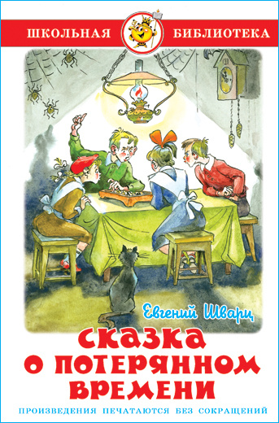

*Что страшнее для школьника?*

Полученная двойка? Скучный урок? Или утром обнаружить, что ты уже старик?
А когда ты дошкольник и читаешь это в одиночестве в тёмной квартире? Да это пугает похлеще Кинга.
Мне очень удачно (или нет?) попалась эта книга в первом классе. Настолько запала в душу, что до сих пор остаётся ощущение страха чего-то не успеть.

И вот тут самое интересное. С одной стороны подстёгивает. Учиться, изучать новое, познавать мир. Не сидеть на месте.
С другой ты не можешь расслабиться. Постоянно себя ругаешь, что должен быть занят полезным делом. Что время уходит. Что ты уже опаздываешь.

Такой вот подарок из первого класса. Спасибо, мам. 😁

В любом случае я бы посоветовал прочитать на досуге. И крайне рекомендовал дошкольникам. Пусть тоже не спят ночами.
Читать с осторожностью. После прочтения в голове может засесть вопрос:

*❓ А сколько времени ты сегодня уже потерял и на что мог бы его потратить?*

=================================================

#### Серия книг чёрный котёнок

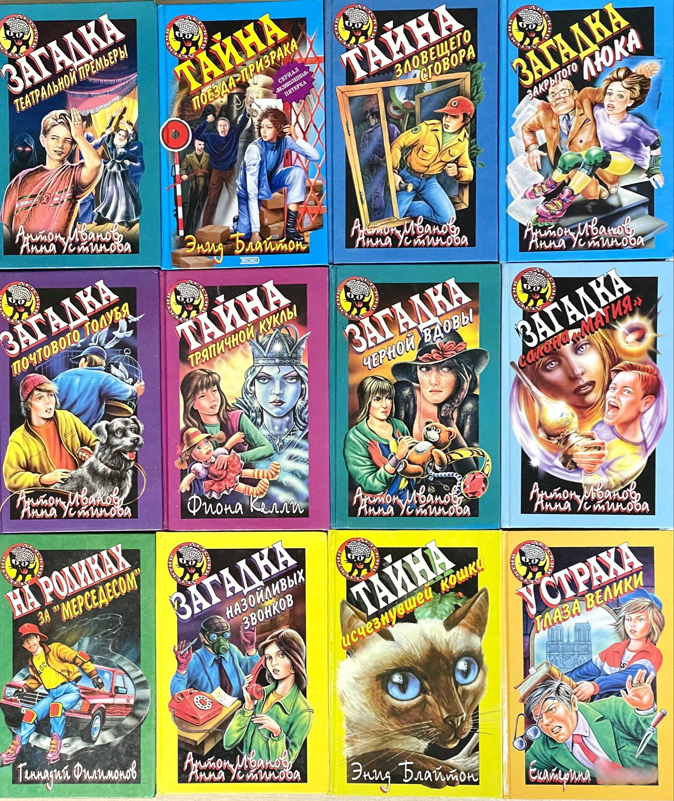

Тут я вскрыл воспоминание и улетел.

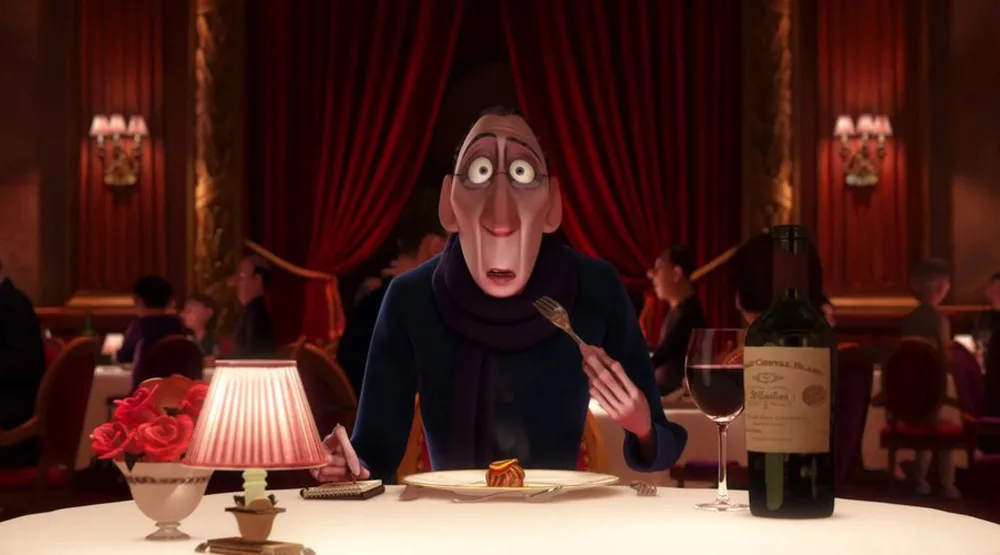

В начальной школе зачитывался книгами этой серии без разбора. Увидел чёрного котёнка? Новое название? Не читал раньше? Берём!

Естественно, уже сейчас и не вспомню, насколько они хорошо были написаны. Скорее всего из разряда книг Донцовой для школьников. Однако впитывал я их масштабно. Мог за неделю осилить 2-3 книги.

Но самый главный плюс, который я получил от всего этого безобразия это статус «Лучший читатель».

Я получил возможность взять на прочтение только что вышедшую книгу «Гарри Поттер и тайная комната». Она только пришла. При мне наклеили корешок и сказали: «Ты будешь первым. Это очень популярная книга».

Кто такой Гарри Поттер я тогда ещё не знал. Философский камень не читал. Но быть первым читателем популярной книги придавало такой гордости, что хоть в рамку вешай.

Стоит ли читать сейчас? Вопрос спорный. Пожалуй, можно найти более интересные книги.

=================================================

#### Сергей Лукьяненко "Серия книг Дозоры" и "Черновик/Чистовик"

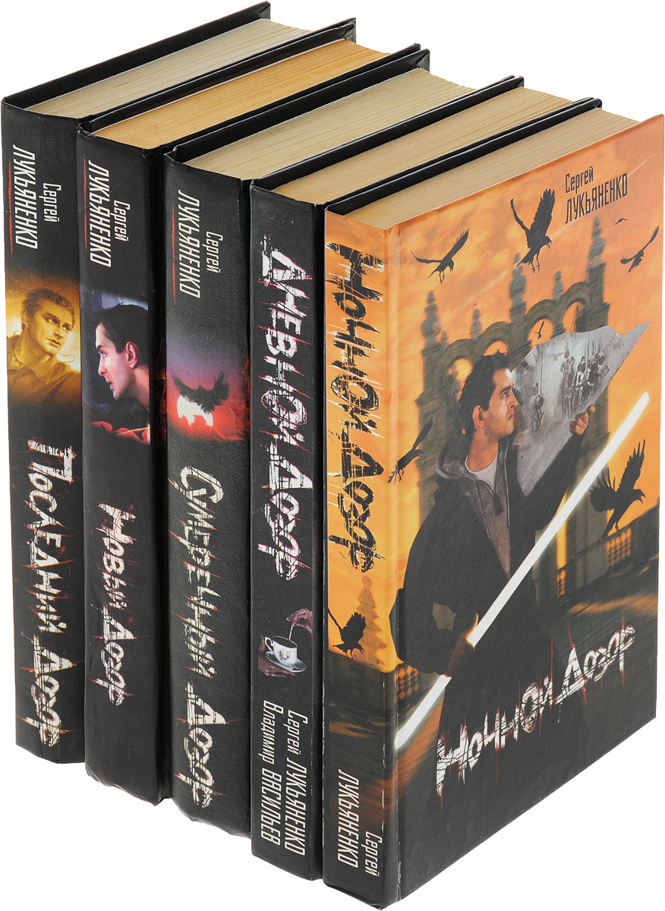 *Серия Дозоров*

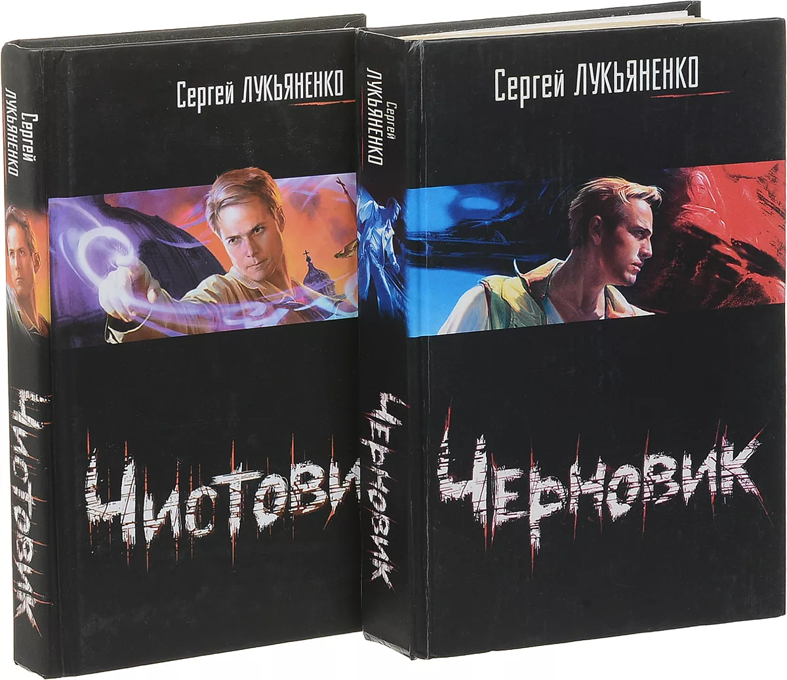 *Черновик/Чистовик*

Дозоры и Черновик это два брата, которые не хотят быть братьями.

Не смог разделить эти книги. Можно сказать, что они настолько же похожи друг на друга, насколько и не похожи. Абсурдно, согласен. Но у одной и второй серии больше схожего, чем кажется.

По обеим сняли фильмы, которые и рядом не стоят с книгами. Главный герой оказывается центром событий сам того не желая. Мысли о государственном строе и смысле жизни. Концовка из разряда «К чёрту всех и вся».

При этом у книг разное настроение и послевкусие. Да и конечная судьба героев совершенно разнится.

Из общего: городская фантастика, отечественный настрой, пасхалки и окружение, которое встречаешь каждый день. Если хочется именно такого — советую к прочтению обе серии.

Читал Дозоры в первые курсы студенчества и перечитал пару лет назад. Ощущения совершенно разные. Первые две книги затягивают тебя с головой. Ты живёшь в этом мире, дышишь им. А далее маэстро уходит в политическое настроение и мысли о высшем. Что сбивает и смотрится немного абсурдно.

В случае с Черновиком ощущение осталось прежним. И если выбирать, то посоветовал бы именно его. В виду более оригинальной задумки.
Правда, Чистовик читать местами сложновато. По той же причине, что и последние книги Дозоров. Маэстро снова улетает в философию, и ты такой: «Лукьяненко, вернись, нормально ж начали». 😁

=================================================

#### Сергей Лукьяненко Серия "Глубина"

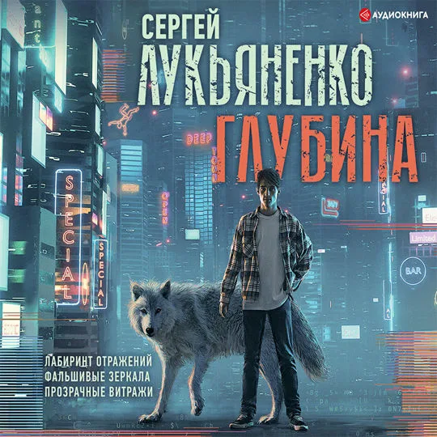

*Глубина, глубина я не твой*

Моё первое погружение в киберпанк.

Сильно дальше я пока так и не продвинулся в жанре. Но невероятно люблю эту серию.
Особенно подойдёт, если ты старичок, который ещё помнит начало зарождения бумерских шутеров. Когда Quake и Unreal казались вершиной технологий, а загрузка уровня в 30 секунд была нормой.

Перечитывал во второй раз. Впечатления остались теми же. И это, пожалуй, лучший комплимент книге.
Детская мечта всех мальчиков 90-х или 00-х оказаться внутри игрового мира. Не просто играть, а именно жить там. Дышать этим воздухом. Чувствовать отдачу оружия в руках.

И вот эта мечта описана с невероятной душой. Ты не просто читаешь. Ты проживаешь всё это вместе с главным героем. Каждый уровень, каждую стычку, каждый момент, когда сердце замирает.

А потом закрываешь книгу и такой: «Блин, мне завтра на работу, а не в рейд». 😁

=================================================

#### Артур Конан Дойл серия книг о Шерлоке Холмса

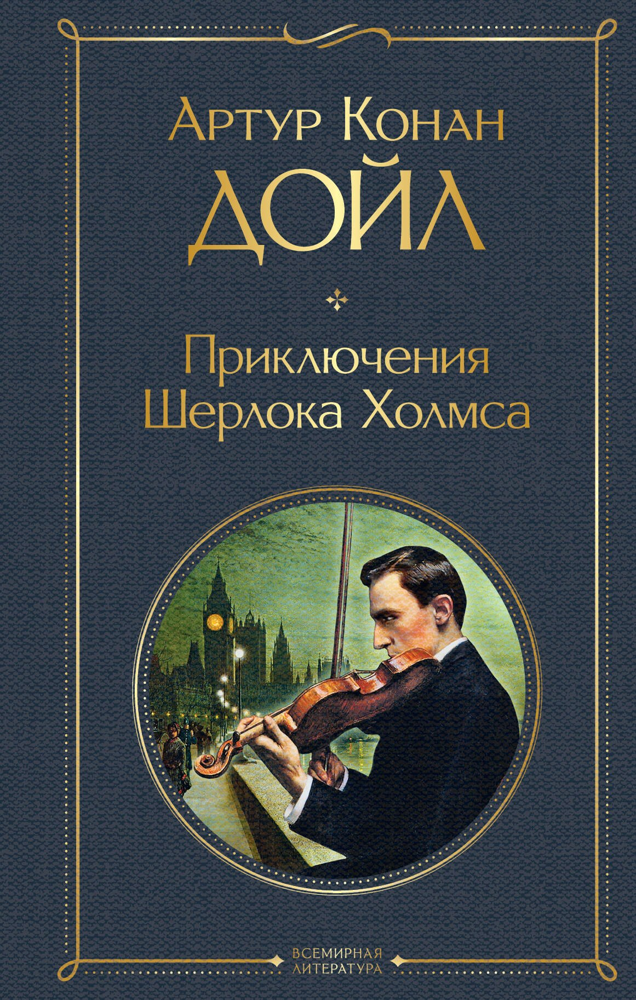

Это классика невероятных масштабов. Сколько было попыток экранизировать удачных и не очень. Не меньше попыток было написать что-то похожее. Подражателей полно, оригинал один.

Однако Шерлок это базовая классика. Та самая, которую хочется рекомендовать.

Но вот что интересно. Главный антагонист в виде Мориарти всегда меня привлекал даже больше, чем Холмс.

Не за злодейство. Не за коварство. А за невероятный склад ума и сообразительность. За то, что он единственный, кто способен быть на равных. И от этого каждая их встреча как шахматная партия, где оба игрока знают, чем всё закончится. Но всё равно играют.

=================================================

#### Марк Мэнсон Тонкое искусство пофигизма

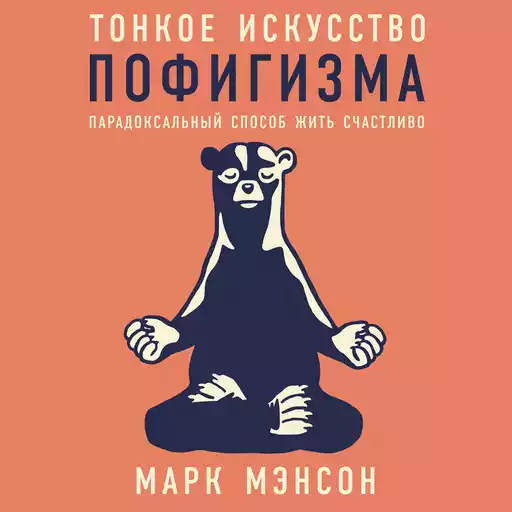

Книга, которая заставила меня копаться в себе 🧠

Эта книга повернула меня надолго. Подарила желание читать околонаучную и психологическую литературу.

Автор не пытается сотворить научный прорыв. Скорее наоборот, книга написана как личный блог.

В некоторых моментах может кольнуть мировоззрение. Особенно по поводу взгляда на Вторую мировую. Но это взгляд человека, который учился в США, поэтому сильно удивляться не стоит. Лично мне даже местами было интересно посмотреть на это с другой стороны.

А в остальном книга отлично помогает покопаться в себе. Дать советы по поводу волнения о будущем и настоящем. Окунуться в мир достигаторства и начать относиться к окружению проще.

Не то чтобы мне стало на всё плевать после прочтения. Но некоторые моменты в мировоззрении я взял именно из этой книги.
Мне стало проще говорить «нет». Проще относиться к неудачам. Проще воспринимать достижения. И уж точно проще смотреть на своё окружение.

Советую начинать знакомство с Марком Мэнсоном именно с этой книги.

#### Марк Мэнсон Всё хреново. Книга о надежде

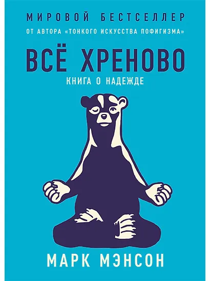

Эта книга будет отличным продолжением после изучения «Тонкого искусства пофигизма».

Книга помогает, как в стрессовых и откровенно провальных ситуациях не терять надежду. Но при этом не ставить на неё все фишки.

Главный посыл книги простой до боли: при любой, даже самой ужасной ситуации, всегда есть два выхода. А даже если выход один именно ты решаешь, в каком виде ты к нему придёшь.

Если понравилась предыдущая книга, то однозначно советую к прочтению.

#### Марк Мэнсон Мужские правила. Отношения. Секс. Психология

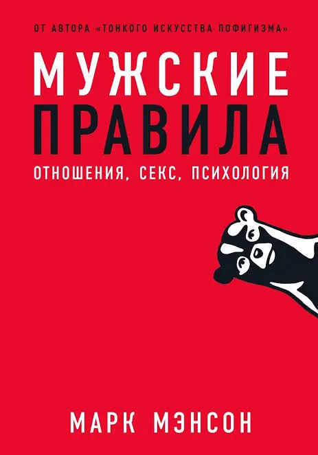

Эта книга стала для меня последней в серии, но не при этом читал с улыбкой и с лёгкостью. Хотя книга и названа как мужские правила, девочкам для любопытства тоже стоит почитать. Многие аспекты конечно субъективны, но в целом когда уже вникаешь в филосифию автора, то читаешь с лёгкостью и пониманием.

В книге описывается как стать более уверенным в себе, не бояться ошибок, даются совету по стилю и личности. Особо понравилась глава об идеологиях. Пожалуй, там я был готов подписаться под каждым символом.

Поэтому я бы крайне советовал ознакомится с книгой мальчикам до 25, а мужчины из 1800 могут понастальгировать и взять для себя пару пометок, но для них уже будет несколько поздно получать такие советы.

=================================================

#### Френсис Скотт Фицджеральд Великий Гэтсби

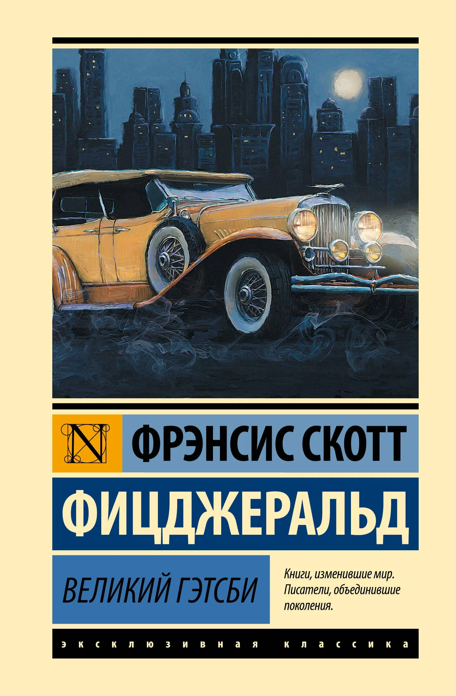

Искренне жалею, что не прочитал эту книгу лет 10 назад. Она бы очень пригодилась. Как и многие о ней узнал увидев фильм с ДиКаприо. Правда фильм я так и не досмотрел. Однако могу сказать, что ДиКаприо настолько локанично вписался в роль Гэтсби, что было сложно представлять его иначе. Всё поведение, характер, ужимки превосходно подходят книжному персонажу.

Саму же книгу по началу несколько сложно читать. Возможно это субъективно. Описанное время для меня не представляет большого интереса. Всё же когда автор углубляется в персонажей, ты не можешь уже оторваться.

Если хочется зарубежной классики, то советую к прочтению.

=================================================

#### Дэниел Киз Цветы для Элджернона

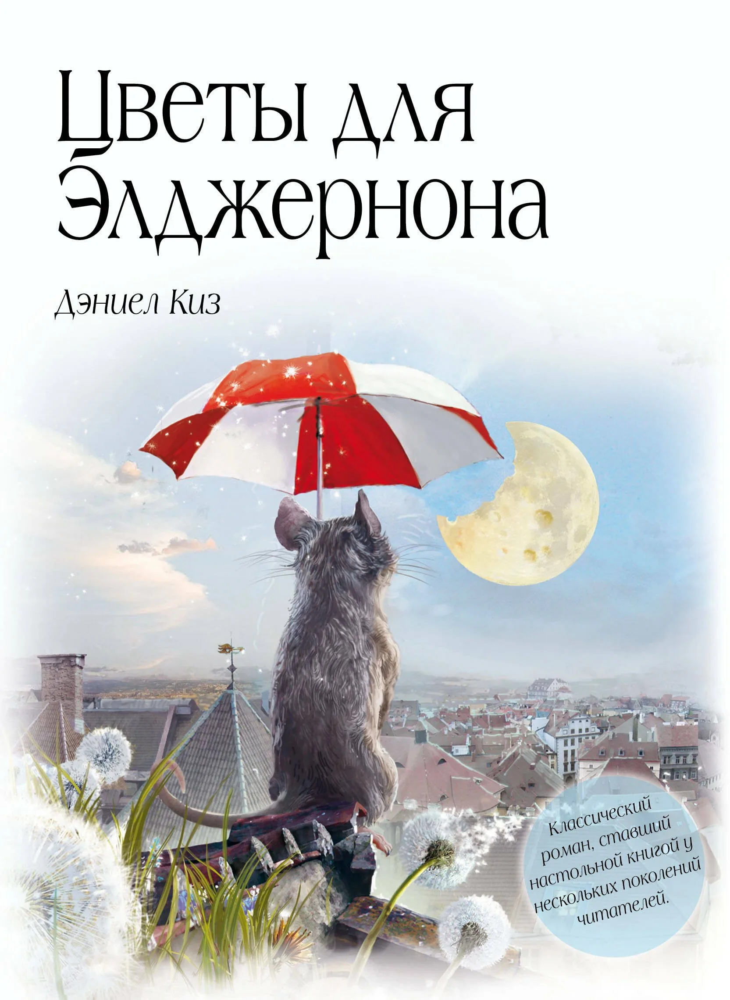

Книга убившая во мне читателя. После её прочтения я не могу несколько месяцев браться за любую другую. История поразила до глубины души. До сих пор при воспоминании проходит лёгкий импульс по телу. Пожалуй, здесь не хочется много говорить, а хочется сказать: "Прочти". Ты сам всё поймешь.

> *На этом пока всё. Еще книги, о которых хотелось бы рассказать остались, но я о них расскажу уже в следующий раз. Итак получился огромный текст*
