[TOC]

### Макрос для сбора сокращений в документе

Возможности макроса:

* сканирует весь документ и находит слова, состоящие полностью из заглавных букв (длиной от 2 символов);
* игнорирует слова в стилях «Заголовок» (чтобы слова вроде «ВВЕДЕНИЕ» или «INTRODUCTION» не попали в список);
* очищает найденные слова от знаков препинания;
* сортирует их по алфавиту и создаёт аккуратную таблицу из двух столбцов;
* выполняет расшифровку в рамках заданного словаря-источника.

#### Предварительные настройки

В MS Word должна быть включена функция разработчика. Для этого необходимо нажать на панели инструментов кнопку "Файл".

<div style="text-align: center;">

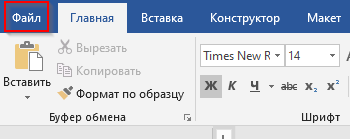
Кнопка "Файл"

</div>

Выбрать в меню "Параметры"

<div style="text-align: center;">

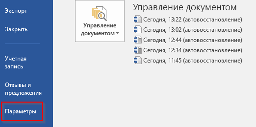
Параметры

</div>

Выбрать раздел "Настроить ленту" и установить чек-бокс "Разработчик". Нажать кнопку "Ок" для сохранения изменений.

<div style="text-align: center;">

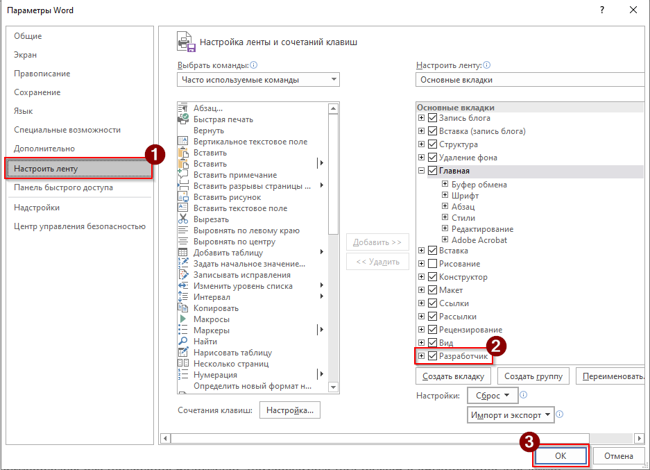
Чек-бокс "Разработчик"

</div>

Во избежание конфликтов, рекомендуется настроить доверенный доступ к объектной модели VBA.
Для этого во вкладке разработчик следует выбрать пункт "Безопасность макросов" и установить чек-бокс "Доверять доступ к объектной модели проектов VBA".

<div style="text-align: center;">

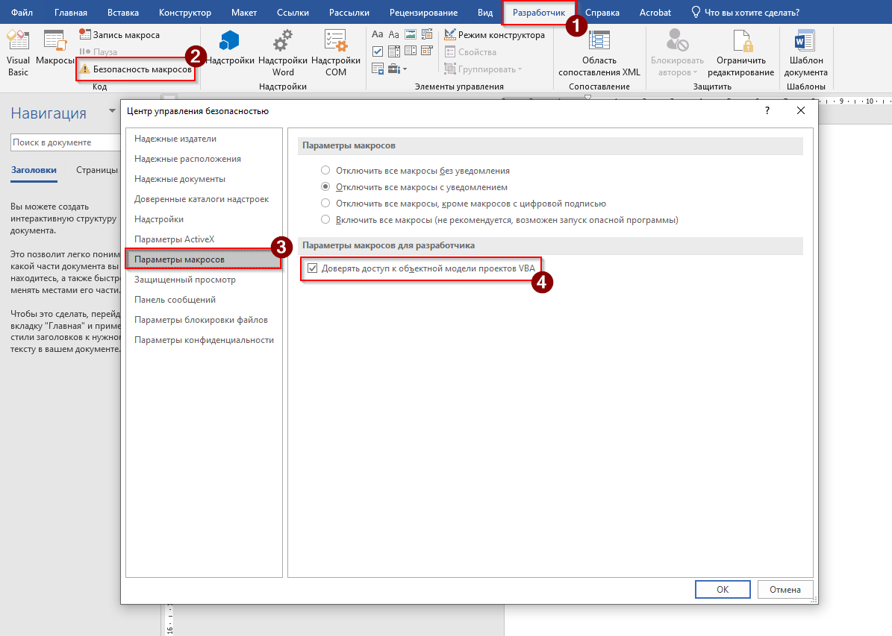

</div>

#### Установка и запуск макроса

В открытом документе нажмите комбинацию клавиш ```Alt + F11```. В результате отобразится редактор VBA. В верхнем меню выберите **Insert > Module** (Вставка > Модуль).

<div style="text-align: center;">

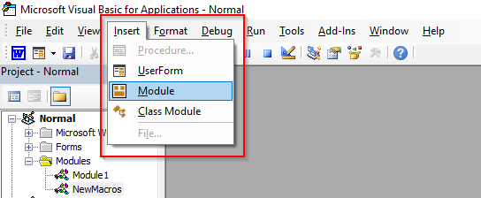
Вставка Модуля

</div>

Для добавления макроса в следует скопировать приведённый код и вставить в модуль. Для сохранения изменений необходимо закрыть редактор VBA и вернуться в документ.

Чатобы запустить макрос следует нажать комбинацию клавиш ```Alt + F8```, выбрать ```GenerateAbbreviationsTable``` из списка и нажать кнопку **Run** (Выполнить).

<div style="text-align: center;">

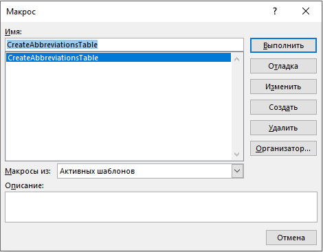
Выполнение макроса

</div>

В результате отобразится диалоговое окно с предложение создать резервную копию документа. Для создания копии следует нажать кнопку "Да", для продолжения без резервной копии – "Нет".

<div style="text-align: center;">

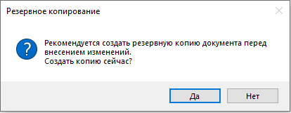
Предложение резервного копирования

</div>

На следующем шаге отобразится окно для выбора словаря-источника с аббревиатурами и их расшифровками, на который будет полагаться макрос.

<div style="text-align: center;">

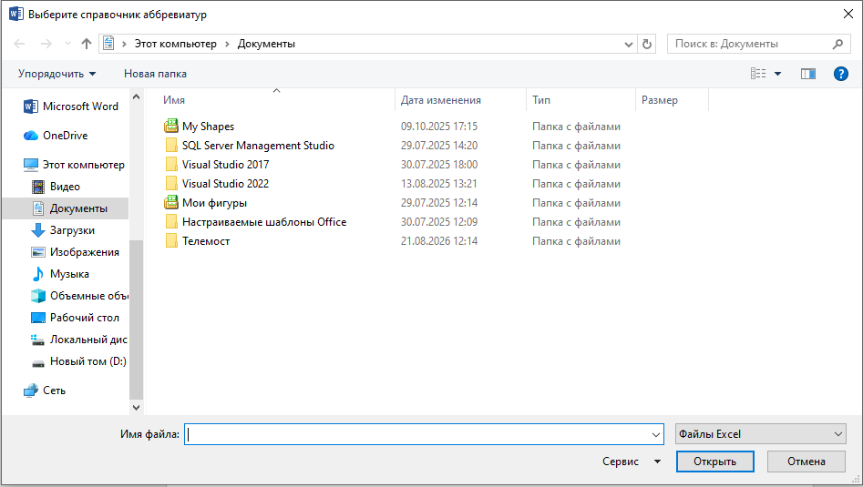
Диалоговое окно выбора файла

</div>

Словарь необходимо подготовить в формате .xls. В словаре необходимо задать таблицу для абрревиатур. Макрос сравнивает слова из первой колонки с найденными сокращениями из документа. При наличии полной схожести добавляет расшифровку из второго столбца.

<div style="text-align: center;">

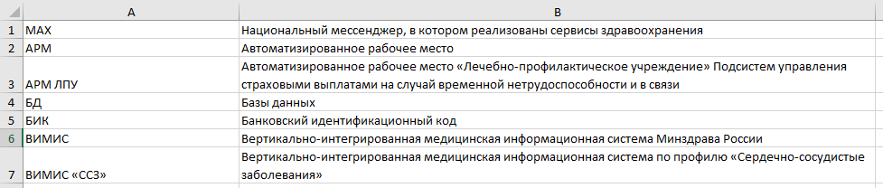
Пример словаря-источника

</div>

В случае успешного выполнения отобразится диалоговое окно с указание количества найденных аббревиатур.

<div style="text-align: center;">

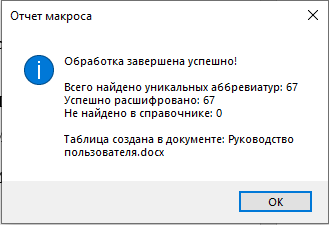
Диалоговое окно об успешном выполнении

</div>

В результате будет сформирована таблица аббревиатур, найденных в документе.

<div style="text-align: center;">

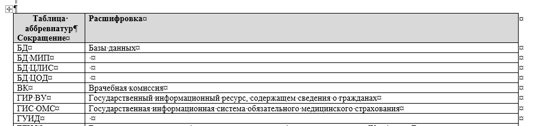
Таблица сокращений

</div>

#### Код макроса

Код макроса:

```VBA

Option Explicit

' Флаг защиты от повторного запуска
Private isRunning As Boolean

' =====================================================================
' ОСНОВНАЯ ПРОЦЕДУРА
' =====================================================================
Public Sub GenerateAbbreviationsTable()
    On Error GoTo ErrorHandler
    
    ' Защита от повторного запуска
    If isRunning Then
        MsgBox "Макрос уже выполняется. Дождитесь завершения.", vbInformation, "Внимание"
        Exit Sub
    End If
    isRunning = True
    
    Application.ScreenUpdating = False
    
    Dim doc As Document
    Set doc = ActiveDocument
    
    ' 1. Запрос на создание резервной копии
    Dim backupAnswer As VbMsgBoxResult
    backupAnswer = MsgBox("Рекомендуется создать резервную копию документа перед внесением изменений." & vbCrLf & _
                          "Создать копию сейчас?", vbYesNo + vbQuestion, "Резервное копирование")
    If backupAnswer = vbYes Then
        Dim backupPath As String
        backupPath = Replace(doc.FullName, ".docx", "_backup.docx")
        backupPath = Replace(backupPath, ".docm", "_backup.docm")
        If doc.Path = "" Then
            MsgBox "Сначала сохраните документ на диск.", vbExclamation
            GoTo CleanUp
        End If
        doc.SaveAs2 FileName:=backupPath
    End If
    
    ' 2. Выбор справочника
    Dim refPath As String
    refPath = SelectReferenceFile()
    If refPath = "" Then GoTo CleanUp ' Пользователь отменил выбор
    
    ' 3. Загрузка словаря
    Dim dictRef As Object
    Set dictRef = LoadDictionary(refPath)
    If dictRef Is Nothing Then GoTo CleanUp
    
    ' 4. Поиск аббревиатур и сопоставление
    Dim foundAbbrs As Object
    Set foundAbbrs = ExtractAndMatchAbbreviations(doc, dictRef)
    
    If foundAbbrs.Count = 0 Then
        MsgBox "В тексте не найдено аббревиатур, подходящих под эвристику.", vbInformation
        GoTo CleanUp
    End If
    
    ' 5. Создание таблицы
    Dim targetDoc As Document
    Dim tbl As Table
    Dim rng As Range
    
    ' Если документ защищен, создаем новый
    If doc.ProtectionType = wdNoProtection Then
        Set targetDoc = doc
        Set rng = targetDoc.Content
        rng.Collapse wdCollapseEnd
        rng.InsertParagraphAfter
        rng.Collapse wdCollapseEnd
    Else
        Set targetDoc = Documents.Add
        Set rng = targetDoc.Content
    End If
    
    Set tbl = CreateReportTable(targetDoc, rng, foundAbbrs)
    
    ' 6. Форматирование таблицы
    FormatTable tbl
    
    ' 7. Отчет
    ShowReport foundAbbrs, dictRef, targetDoc

CleanUp:
    Application.ScreenUpdating = True
    isRunning = False
    Exit Sub

ErrorHandler:
    Application.ScreenUpdating = True
    isRunning = False
    MsgBox "Ошибка " & Err.Number & " в процедуре GenerateAbbreviationsTable:" & vbCrLf & _
           Err.Description, vbCritical, "Сбой макроса"
End Sub

' =====================================================================
' ВЫБОР ФАЙЛА СПРАВОЧНИКА
' =====================================================================
Private Function SelectReferenceFile() As String
    Dim fd As FileDialog
    Set fd = Application.FileDialog(msoFileDialogFilePicker)
    
    With fd
        .Title = "Выберите справочник аббревиатур"
        .Filters.Clear
        .Filters.Add "Файлы Excel", "*.xlsx; *.xlsm; *.xls"
        .Filters.Add "Текстовые файлы", "*.csv; *.txt"
        .AllowMultiSelect = False
        If .Show = -1 Then
            SelectReferenceFile = .SelectedItems(1)
        Else
            SelectReferenceFile = ""
        End If
    End With
End Function

' =====================================================================
' ЗАГРУЗКА СПРАВОЧНИКА В СЛОВАРЬ
' =====================================================================
Private Function LoadDictionary(filePath As String) As Object
    On Error GoTo ErrLoad
    
    Dim dict As Object
    Set dict = CreateObject("Scripting.Dictionary")
    dict.CompareMode = vbTextCompare ' Регистронезависимое сравнение
    
    Dim ext As String
    ' ИСПРАВЛЕНО: берем 5 символов для корректной проверки .xlsx и .xlsm
    ext = LCase(Right(filePath, 5))
    
    If ext = ".xlsx" Or ext = ".xlsm" Or Right(ext, 4) = ".xls" Then
        ' Обработка Excel (позднее связывание)
        Dim xlApp As Object, xlWb As Object, xlWs As Object
        Set xlApp = CreateObject("Excel.Application")
        
        If xlApp Is Nothing Then
            MsgBox "Не удалось создать объект Excel. Возможно, Excel не установлен или поврежден." & vbCrLf & _
                   "Пожалуйста, сохраните справочник в формате CSV или TXT и попробуйте снова.", vbCritical
            Set LoadDictionary = Nothing
            Exit Function
        End If
        
        xlApp.Visible = False
        xlApp.DisplayAlerts = False
        Set xlWb = xlApp.Workbooks.Open(filePath)
        Set xlWs = xlWb.Sheets(1)
        
        Dim lastRow As Long
        lastRow = xlWs.Cells(xlWs.Rows.Count, 1).End(-4162).Row ' -4162 = xlUp
        
        Dim i As Long
        Dim abbr As String, decr As String
        For i = 2 To lastRow
            abbr = Trim(CStr(xlWs.Cells(i, 1).Value))
            decr = Trim(CStr(xlWs.Cells(i, 2).Value))
            
            If abbr <> "" And decr <> "" Then
                If dict.Exists(abbr) Then
                    If dict(abbr) <> decr Then
                        dict(abbr) = dict(abbr) & " [Конфликт: " & decr & "]"
                    End If
                Else
                    dict.Add abbr, decr
                End If
            End If
        Next i
        
        xlWb.Close False
        xlApp.Quit
        Set xlWs = Nothing: Set xlWb = Nothing: Set xlApp = Nothing
        
    Else
        ' Обработка CSV/TXT
        Dim fso As Object, ts As Object
        Set fso = CreateObject("Scripting.FileSystemObject")
        Set ts = fso.OpenTextFile(filePath, 1, False, -2) ' -2 = TristateUseDefault
        
        ' Определение разделителя по первой строке
        Dim firstLine As String
        firstLine = ts.ReadLine
        Dim delim As String
        Dim cCount As Long, sCount As Long, tCount As Long
        
        cCount = UBound(Split(firstLine, ","))
        sCount = UBound(Split(firstLine, ";"))
        tCount = UBound(Split(firstLine, vbTab))
        
        ' ИСПРАВЛЕНО: Однострочный If с ElseIf недопустим в VBA.
        ' Переписано на многострочный блок с обязательным End If.
        If tCount >= cCount And tCount >= sCount Then
            delim = vbTab
        ElseIf sCount >= cCount Then
            delim = ";"
        Else
            delim = ","
        End If
        
        Dim parts() As String
        Dim lineText As String
        
        ' Чтение данных
        Do While Not ts.AtEndOfStream
            lineText = ts.ReadLine
            parts = Split(lineText, delim)
            If UBound(parts) >= 1 Then
                abbr = Trim(parts(0))
                decr = Trim(parts(1))
                If abbr <> "" And decr <> "" Then
                    If dict.Exists(abbr) Then
                        If dict(abbr) <> decr Then
                            dict(abbr) = dict(abbr) & " [Конфликт: " & decr & "]"
                        End If
                    Else
                        dict.Add abbr, decr
                    End If
                End If
            End If
        Loop
        ts.Close
    End If
    
    Set LoadDictionary = dict
    Exit Function

ErrLoad:
    MsgBox "Ошибка чтения справочника: " & Err.Description, vbCritical
    Set LoadDictionary = Nothing
End Function

' =====================================================================
' ПОИСК АББРЕВИАТУР И СОПОСТАВЛЕНИЕ
' =====================================================================
Private Function ExtractAndMatchAbbreviations(doc As Document, dictRef As Object) As Object
    Dim re As Object
    Set re = CreateObject("VBScript.RegExp")
    re.Global = True
    re.IgnoreCase = False
    ' Эвристика: 2+ заглавных букв, далее опционально пробел/дефис/слеш и еще заглавные/цифры
    re.Pattern = "(?:^|[^А-Яа-яЁё0-9])([А-ЯЁ]{2,}(?:[ \-\/][А-ЯЁ0-9]+)*)(?:[^А-Яа-яЁё0-9]|$)"
    
    Dim text As String
    text = doc.Content.text
    
    Dim matches As Object
    Set matches = re.Execute(text)
    
    Dim resultDict As Object
    Set resultDict = CreateObject("Scripting.Dictionary")
    resultDict.CompareMode = vbTextCompare ' Регистронезависимое сравнение
    
    ' Черный список для исключения ложных срабатываний
    Dim blacklist As Variant
    blacklist = Array("НА", "ПО", "ДО", "ОТ", "КО", "СО", "ОБ", "ИЗ", "УЖ", "ЭХ", "АХ", "ОХ", "УХ", "ЫХ", "ЕЕ", "ОО", "АА", "ИИ", _
                      "ПРАЙМ", "АПИ", "АПИ ИЭМК", "БЕЗ", "ОК", "ООО", "ПРАЙМ ГРУП", "РЕГИОН БОТА", _
                      "РЕД ОС")
    
    Dim m As Object
    Dim abbr As String
    Dim isBlacklisted As Boolean
    Dim blItem As Variant
    
    For Each m In matches
        abbr = UCase(Trim(m.SubMatches(0)))
        
        ' 1. Проверка черного списка
        isBlacklisted = False
        For Each blItem In blacklist
            If abbr = blItem Then
                isBlacklisted = True
                Exit For
            End If
        Next blItem
        
        If Not isBlacklisted Then
            
            ' 2. НОВОЕ: Проверка длины каждого "слова" (части аббревиатуры)
            ' Если в одном слове больше 6 символов, не добавляем в таблицу
            Dim tempAbbr As String
            tempAbbr = Replace(Replace(abbr, "/", "-"), " ", "-")
            Dim abbrWords As Variant
            abbrWords = Split(tempAbbr, "-")
            
            Dim isValidLength As Boolean
            isValidLength = True
            Dim wordPart As Variant
            
            For Each wordPart In abbrWords
                If Len(wordPart) > 6 Then
                    isValidLength = False
                    Exit For
                End If
            Next wordPart
            
            ' Если все части прошли проверку длины
            If isValidLength Then
                
                ' 3. НОВОЕ: Явная проверка на дубликат.
                ' Dictionary уже не хранит дубликаты ключей, но проверка Exists
                ' гарантирует, что мы не будем повторно обрабатывать и добавлять
                ' уже найденную аббревиатуру в словарь результатов.
                If Not resultDict.Exists(abbr) Then
                    If dictRef.Exists(abbr) Then
                        resultDict.Add abbr, dictRef(abbr)
                    Else
                        resultDict.Add abbr, " "
                    End If
                End If
                
            End If
        End If
    Next m
    
    Set ExtractAndMatchAbbreviations = resultDict
End Function

' =====================================================================
' СОЗДАНИЕ ТАБЛИЦЫ
' =====================================================================
Private Function CreateReportTable(doc As Document, rng As Range, dataDict As Object) As Table
    Dim tbl As Table
    Set tbl = doc.Tables.Add(rng, dataDict.Count + 1, 2)
    
    ' Заголовки
    tbl.Cell(1, 1).Range.text = "Сокращение"
    tbl.Cell(1, 2).Range.text = "Расшифровка"
    
    ' Сортировка ключей
    Dim keys As Variant
    keys = dataDict.keys
    SortArray keys
    
    ' Заполнение данных
    Dim i As Long
    For i = 0 To UBound(keys)
        tbl.Cell(i + 2, 1).Range.text = keys(i)
        tbl.Cell(i + 2, 2).Range.text = dataDict(keys(i))
    Next i
    
    Set CreateReportTable = tbl
End Function

' =====================================================================
' ФОРМАТИРОВАНИЕ ТАБЛИЦЫ
' =====================================================================
Private Sub FormatTable(tbl As Table)
    tbl.Borders.Enable = True
    tbl.AutoFitBehavior wdAutoFitContent
    
    ' Выделение заголовка
    With tbl.Rows(1)
        .Range.Font.Bold = True
        .Range.Font.Color = wdColorBlack
        .Shading.BackgroundPatternColor = wdColorGray15
    End With
    
    ' Добавление подписи над таблицей
    Dim rngTitle As Range
    Set rngTitle = tbl.Range
    rngTitle.Collapse wdCollapseStart
    rngTitle.InsertParagraphBefore
    rngTitle.InsertBefore "Таблица аббревиатур"
    rngTitle.Paragraphs(1).Range.Font.Bold = True
    rngTitle.Paragraphs(1).Alignment = wdAlignParagraphCenter
End Sub

' =====================================================================
' ВЫВОД ОТЧЕТА
' =====================================================================
Private Sub ShowReport(foundDict As Object, refDict As Object, targetDoc As Document)
    Dim totalFound As Long, decrypted As Long, notFound As Long
    Dim key As Variant
    
    totalFound = foundDict.Count
    For Each key In foundDict.keys
        If foundDict(key) = "Не найдено в справочнике" Then
            notFound = notFound + 1
        Else
            decrypted = decrypted + 1
        End If
    Next key
    
    Dim msg As String
    msg = "Обработка завершена успешно!" & vbCrLf & vbCrLf
    msg = msg & "Всего найдено уникальных аббревиатур: " & totalFound & vbCrLf
    msg = msg & "Успешно расшифровано: " & decrypted & vbCrLf
    msg = msg & "Не найдено в справочнике: " & notFound & vbCrLf & vbCrLf
    msg = msg & "Таблица создана в документе: " & targetDoc.Name
    
    MsgBox msg, vbInformation, "Отчет макроса"
End Sub

' =====================================================================
' ВСПОМОГАТЕЛЬНАЯ ФУНКЦИЯ: СОРТИРОВКА МАССИВА
' =====================================================================
Private Sub SortArray(arr As Variant)
    Dim i As Long, j As Long
    Dim temp As String
    For i = LBound(arr) To UBound(arr) - 1
        For j = i + 1 To UBound(arr)
            If arr(i) > arr(j) Then
                temp = arr(i)
                arr(i) = arr(j)
                arr(j) = temp
            End If
        Next j
    Next i
End Sub

```
